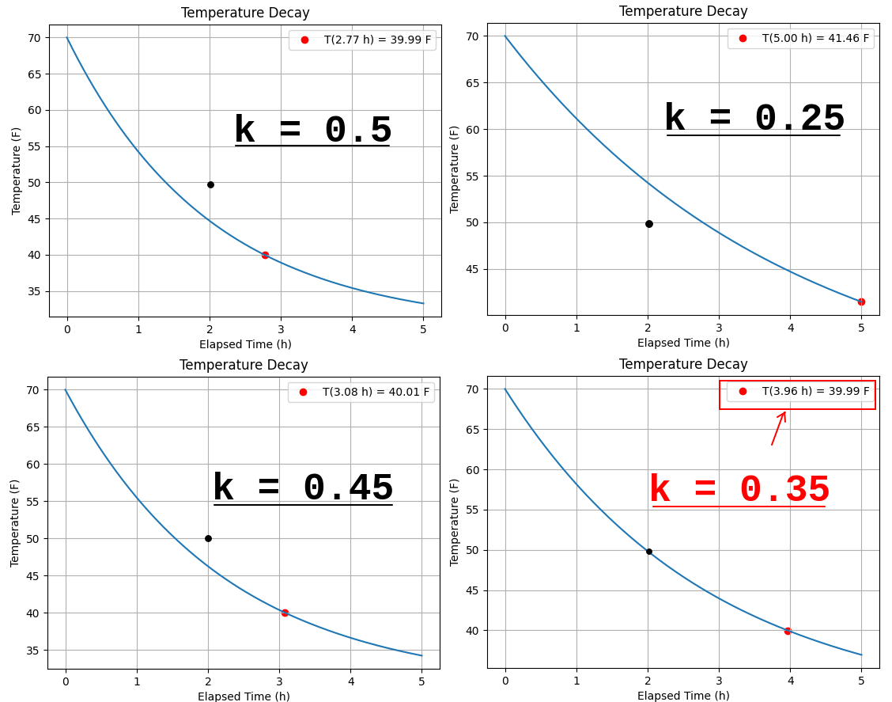
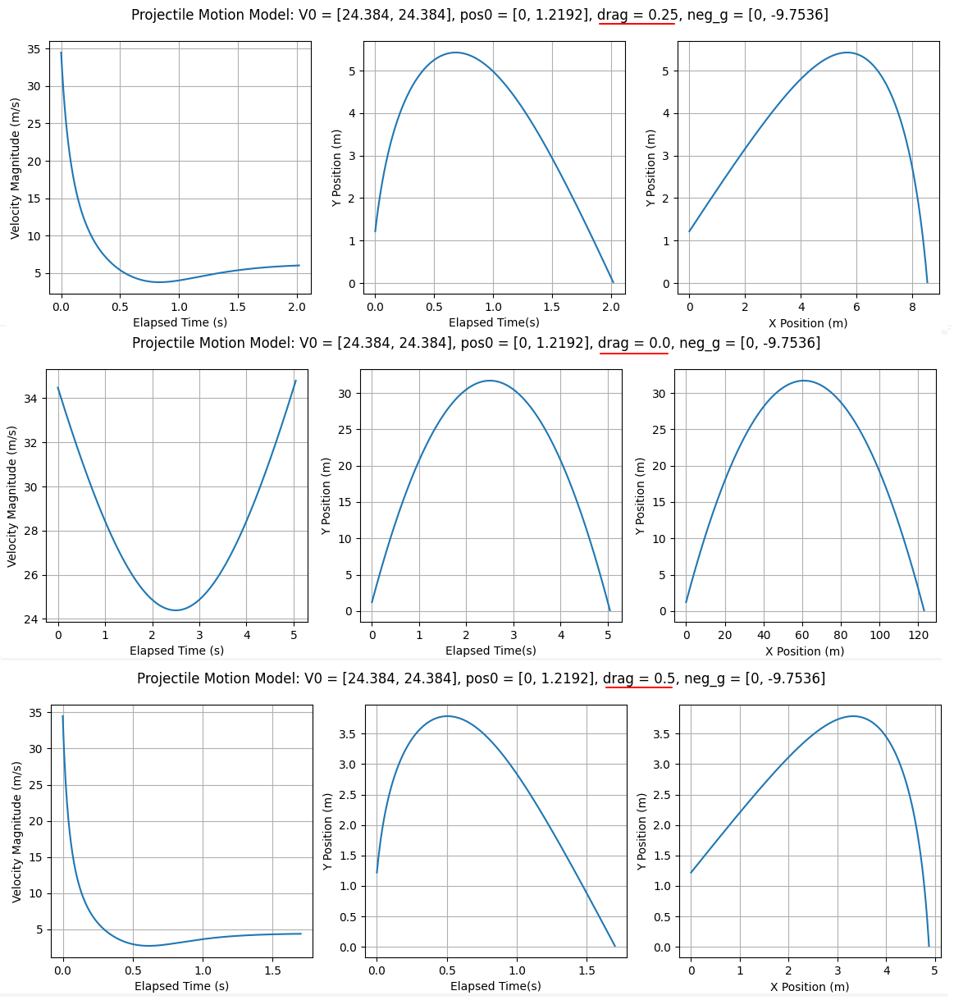
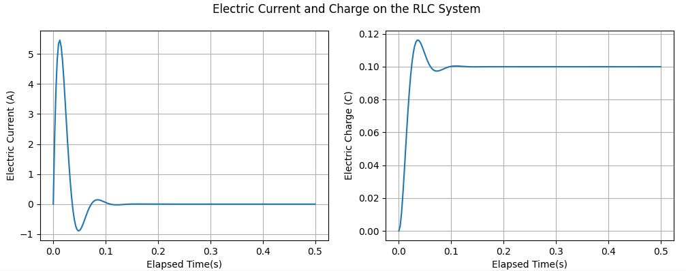
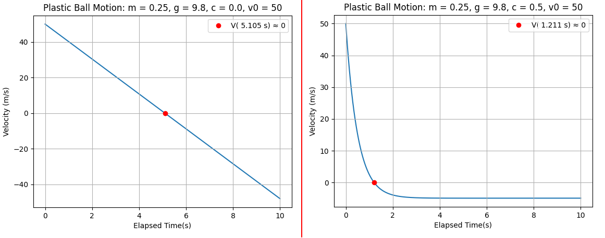
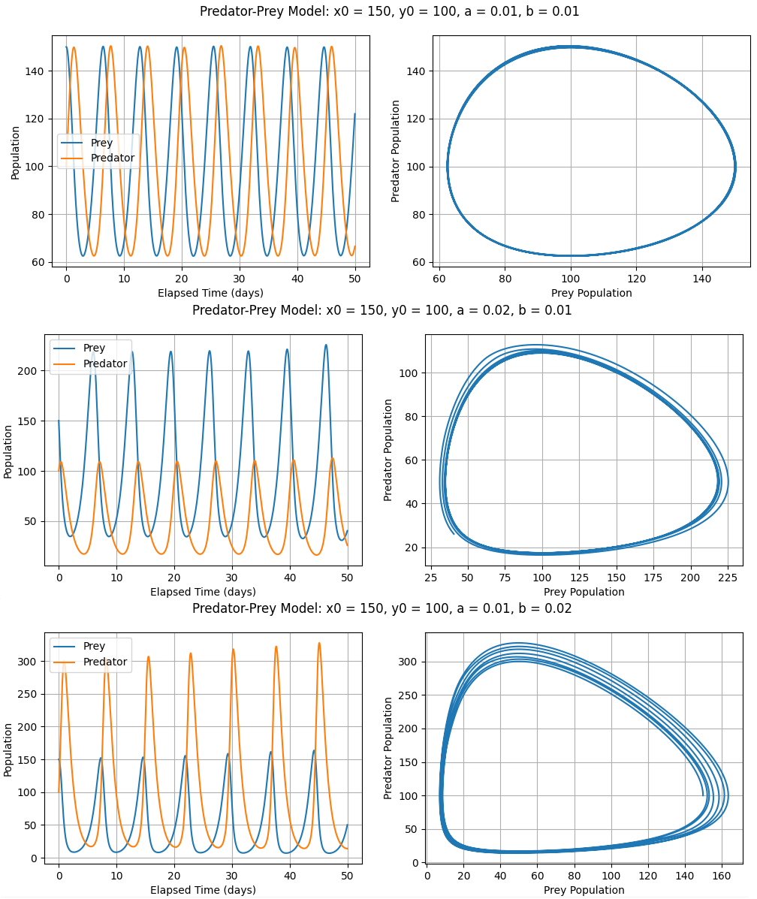

# Dynamical Systems Simulation in Python

This repository contains computational simulations of several **dynamical systems** modelled by **ordinary differential equations (ODEs)**.  
All simulations were implemented in **Python** using the scientific library **SciPy** and numerically solved with the `scipy.integrate.solve_ivp` function (RK45 Runge–Kutta method).

Each simulation includes:
- The mathematical model and ODE formulation;
- Python implementation;
- Visual results and physical discussion.


For further details read the [`full report`](./report/lista2.pdf) (Portuguese only).

---

## Simulated Systems

### 1. Newton’s Law of Cooling

The cooling of a body in a constant ambient temperature follows:

$$
\frac{dT}{dt} = -k(T - T_a)
$$
$$
T(t) = T_a + (T_0 - T_a)e^{-kt}
$$

This model estimates the **cooling constant** `k` and predicts the time when the indoor temperature reaches a target value.

<p align="center">
  
</p>

---

### 2. Projectile Motion with Air Drag

A projectile is launched under gravity and aerodynamic drag proportional to velocity:

```math
\begin{pmatrix}
\ddot{x}\\
\ddot{y}
\end{pmatrix}
=
-\begin{pmatrix} g_x \\ g_y \end{pmatrix}
-
k\sqrt{\dot{x}^2+\dot{y}^2}
\begin{pmatrix}
\dot{x}\\
\dot{y}
\end{pmatrix}
```

The simulation integrates position and velocity simultaneously, displaying time evolution of velocity magnitude, height, and the projectile’s trajectory.

<p align="center">
  
</p>

---

### 3. RLC Electric Circuit

The RLC circuit satisfies Kirchhoff’s Voltage Law:

$$
v(t) = R\,i(t) + L\,\frac{di}{dt} + \frac{1}{C}q(t)
$$
$$
\ddot{q}(t) = \frac{1}{L}\left[v(t) - \frac{1}{C}q(t) - R\dot{q}(t)\right]
$$

The code computes **current** and **charge** over time for both constant and sinusoidal voltage inputs, revealing **transient** and **steady-state** regimes.

<p align="center">
  
</p>

---

### 4. Plastic Ball Motion

A lightweight ball thrown vertically, subject to gravity and air resistance, obeys:

$$
m\ddot{x} + c\dot{x} + mg = 0,\quad
x(0)=0,\quad \dot{x}(0)=v_0
$$
$$
\dot{v} = \frac{1}{m}(-cv - mg)
$$

The simulation compares cases **with and without drag**, showing the emergence of **terminal velocity** when resistance is considered.

<p align="center">
  
</p>

---

### 5. Predator–Prey Model (Lotka–Volterra)

The population dynamics of two interacting species (prey and predator) are modeled as:

$$
\dot{x} = x - axy, \quad
\dot{y} = -y + bxy
$$

The simulation explores oscillatory behavior and equilibrium under varying contact coefficients and initial populations.

<p align="center">
  
</p>

---

## ⚙️ Technologies

- **Python 3.x**
- **NumPy**
- **SciPy** (`solve_ivp` — RK45 integrator)
- **Matplotlib**

---

## How to Run

1. **Clone the repository**
   ```bash
   git clone https://github.com/fpelogia/dynamical-systems-modelling.git
   cd dynamical-systems-modelling
   ```

2. **Create virtual environment and install requirements**
   ```bash
   python -m venv venv
   source venv/bin/activate
   pip install -r requirements
   ```

3. **Run any simulation**
   ```bash
   python newton_cooling.py
   python projectile-motion.py
   python rlc_circuit.py
   python plastic_ball.py
   python plastic_ball_2o.py
   python predator-prey.py
   ...
   ```

Each script generates plots and prints numerical results.
---

## References

1. **J.R. Dormand & P.J. Prince (1980)** — *A family of embedded Runge–Kutta formulae*, *Journal of Computational and Applied Mathematics*, 6(1), 19–26.  
2. **R. Herman (2017)** — *Solving Differential Equations Using Simulink*, [link](http://people.uncw.edu/hermanr/mat361/Simulink/ODE_Simulink.pdf).  
3. **SciPy Library** — [https://www.scipy.org](https://www.scipy.org)

---

## Author

**Frederico José Ribeiro Pelogia**  
Department of Science and Technology, Federal University of São Paulo (UNIFESP)  
*Originally developed during the Dynamic Systems Control course (2020).*
